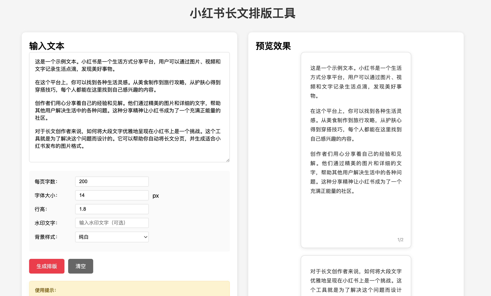

# 小红书长文排版工具
> 本项目为个人前端练习，欢迎交流指正！
一个帮助创作者将长文本自动排版成小红书图片格式的前端工具。

## 🚀 在线使用

**[👉 点击这里立即体验](https://Nowhereman-in-Galaxy.github.io/xiaohongshu-text-layout/)**

无需下载，直接在浏览器中使用！

## ✨ 功能特点

- 📄 **智能分页**：段落整体分页，超长段落自动智能拆分，内容不会溢出页码/水印
- 📝 **Markdown支持**：支持 #/##/### 标题、**加粗**、*斜体*、__下划线__、~~删除线~~、[color:#ff0000]彩色文字[/color]、标准Markdown表格等
- 👀 **实时预览**：所见即所得，预览与下载图片100%一致
- 🎨 **多种背景纹理**：支持纯色、渐变、纸张、横线、网格、便笺、笔记本等多种背景
- 🖋️ **自定义字体**：可上传本地字体文件，或选择常用中文/英文字体
- ⚙️ **灵活设置**：可调整字体大小、行高、图片比例、页眉/水印等
- 💾 **批量导出**：支持单页或全部页面一键下载，图片高清（可调导出清晰度）
- 💧 **水印功能**：可添加自定义水印
- 📋 **表格渲染**：支持标准Markdown表格，自动分页不拆断表格

## 📸 效果展示



## 🎯 使用方法

1. **访问工具**：[点击这里](https://Nowhereman-in-Galaxy.github.io/xiaohongshu-text-layout/)
2. **输入文本**：在左侧文本框粘贴或输入你的长文，支持Markdown格式
3. **调整设置**：
   - 字体、行高、图片比例、背景、纹理、字体等
   - 可自定义页眉、水印
4. **生成排版**：点击"生成排版"按钮
5. **下载图片**：预览满意后下载单页或全部页面，导出图片与预览完全一致

## 💻 本地开发

如果你想在本地修改或扩展功能:

```bash
# 克隆项目
git clone https://github.com/Nowhereman-in-Galaxy/xiaohongshu-text-layout.git

# 进入项目目录
cd xiaohongshu-text-layout

# 用浏览器打开
open index.html  # macOS
# 或
start index.html  # Windows
# 或直接双击 index.html 文件
```

## 🤝 贡献指南

欢迎贡献！如果你有好的想法或发现了问题：

1. Fork 这个仓库
2. 创建你的功能分支 (`git checkout -b feature/AmazingFeature`)
3. 提交你的修改 (`git commit -m 'Add some AmazingFeature'`)
4. 推送到分支 (`git push origin feature/AmazingFeature`)
5. 提交 Pull Request

## 📋 待办事项

- [ ] 添加更多字体选择
- [ ] 支持插入图片
- [ ] 自定义页面尺寸
- [ ] 深色模式
- [ ] 导出 PDF 格式
- [ ] 添加更多背景模板
- [ ] 支持 Emoji 表情
- [ ] 历史记录功能

## 📄 许可证

本项目采用 MIT 许可证 - 查看 [LICENSE](LICENSE) 文件了解详情

## 👨‍💻 作者

- GitHub: [@Yutong Wu](https://github.com/Nowhereman-in-Galaxy)

## 🙏 致谢

感谢所有为这个项目做出贡献的人！

---

如果这个工具对你有帮助，欢迎给个 ⭐ Star！