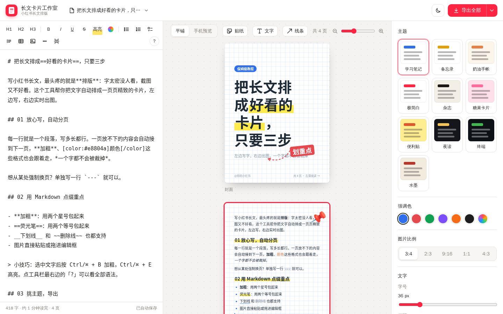
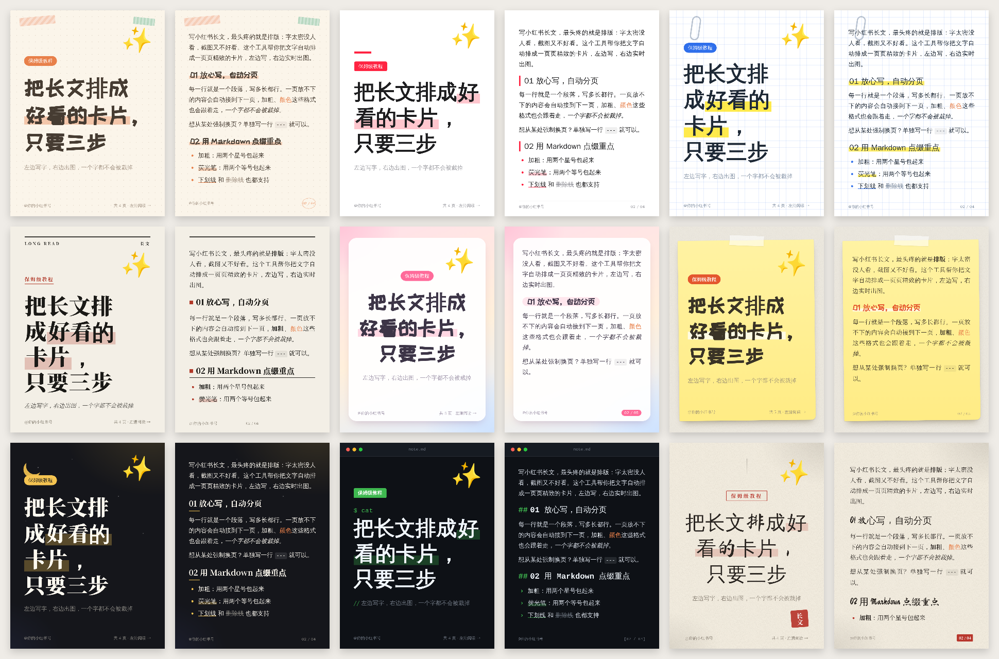

# 长文卡片工作室 · 小红书长文排版

> 本项目为个人前端练习，欢迎交流指正！

把长文自动排成一页页精致的小红书图片卡片：**左边写，右边实时出图**。


## 🚀 在线使用

**[👉 点击这里立即体验](https://Nowhereman-in-Galaxy.github.io/xiaohongshu-text-layout/)**

不用下载，也不用注册，打开浏览器就能用。电脑和手机都可以。



## ✨ 能做什么

### 📄 真正可靠的自动分页
- 在浏览器里**真实测量**排版，而不是估算字数：换字体、调字号，内容都**不会溢出，也不会被裁掉**
- 长段落自动接到下一页，加粗、颜色、高亮这些**格式跟着走**
- 遵守中文排版规则：下一页不会以「，。」开头，英文单词不会被拦腰截断
- 长表格跨页时**自动重复表头**；标题不会孤零零地留在页尾
- 写一行 `---` 可以强制分页

### 🎨 9 套主题
奶油手帐、极简白、学习笔记、杂志、糖果卡片、便利贴、夜读、终端、水墨。每套都可以换强调色，也能单独调字号、行距、段距、首行缩进和字体（支持上传自己的字体）。



### 🖼 自动封面
自动用文中第一个 `# 标题` 生成封面，标题字号自动放到最大。可以加副标题、角标（「干货」「保姆级」……）和贴纸。

### 📱 手机预览
模拟笔记发出去以后的样子：**笔记页**可以左右滑动看图，**发现页**里你的封面和别人的笔记摆在一起，够不够吸引人一眼就知道。


### 💾 导出
- 导出全部（ZIP 压缩包）、单张下载、复制到剪贴板
- 手机上可以通过系统分享面板**一键存到相册**
- 标准 1080px 或高清 2160px
- 导出的图片和预览**逐像素一致**（有自动化测试保证）

### 其它
- 草稿箱：自动保存在浏览器里，刷新、关掉都不会丢
- 图片：直接**粘贴**或**拖进**编辑框
- 快捷键：`Ctrl/⌘ + B` 加粗、`Ctrl/⌘ + I` 斜体、`Ctrl/⌘ + E` 高亮、`Ctrl/⌘ + Enter` 分页
- 在编辑器里移动光标，预览区会高亮对应的那一页；双击预览页可以跳回编辑器
- 深色模式

## ✍️ 语法速查

| 写法 | 效果 |
| --- | --- |
| `# 标题` / `## 标题` / `### 标题` | 一、二、三级标题 |
| `**加粗**` `*斜体*` `__下划线__` `~~删除线~~` | 文字样式 |
| `==高亮==` | 荧光笔高亮 |
| `[color:#e8804a]文字[/color]` | 彩色文字 |
| `- 列表` / `1. 列表` | 无序 / 有序列表（缩进两个空格变成子项） |
| `- [ ] 待办` / `- [x] 完成` | 待办清单 |
| `> 引用` | 引用块 |
| `\| 表头 \| 表头 \|` | 表格 |
| ` ``` ` | 代码块 |
| `` | 图片 |
| `***` | 装饰分隔线 |
| `---` | **分页符** |
| `#话题` | 话题标签 |

和标准 Markdown 不同的地方：**每一行就是一个段落**（不用空一行）；多按几次回车可以留出空白。

## ❓ 常见问题

**字体显示和截图里不一样？**
部分主题用了网络字体（快乐体、毛笔字、思源宋体），网络不通时会自动换成电脑里的字体，排版和导出都不受影响。想要稳定的效果，可以在「字体」里上传自己的字体文件。

**草稿存在哪里？**
只存在你当前使用的浏览器里，不会上传到任何服务器。换电脑或清除浏览器数据后就没有了，重要的内容记得自己备份。

**小红书一篇最多放几张图？**
超过 18 页时，状态栏会提醒你。

## 🗂 项目结构

纯静态网页，没有构建步骤。直接双击 `index.html` 就能用。

```
index.html          页面结构
css/app.css         工作室界面的样式
css/pages.css       卡片页面和 9 套主题的样式（导出的图片长什么样由它决定）
js/markdown.js      Markdown 解析器：文字 → 一个个「块」（纯逻辑，可以单独测试）
js/paginate.js      分页引擎：在看不见的测量台上真实排版，放不下就拆分换页
js/render.js        把块渲染成 HTML，搭出页面骨架和封面
js/themes.js        主题清单：名字、推荐色、装饰元素
js/exporter.js      导出 PNG / ZIP，只嵌入用到的字体分片
js/phone.js         手机预览
js/store.js         草稿箱和图片的本地存储
js/app.js           把上面所有部分串起来
lib/                第三方库（modern-screenshot、JSZip），放在仓库里以便离线和国内访问
tests/unit/         单元测试（Node 直接运行）
tests/e2e/          端到端测试（在真实浏览器里检查分页和导出）
```

## 💻 本地开发

```bash
# 克隆项目
git clone https://github.com/Nowhereman-in-Galaxy/xiaohongshu-text-layout.git
cd xiaohongshu-text-layout

# 直接用浏览器打开 index.html 就能用。
# 想跑测试的话，先安装开发依赖：
npm install
npm test                                # 单元测试
npx playwright install chromium         # 第一次跑端到端测试前需要
npm run test:e2e                        # 端到端测试
npm start                               # 本地服务器 http://localhost:8080
```

每次提交 Pull Request，GitHub Actions 都会自动跑一遍所有测试（配置在 `.github/workflows/test.yml`）。

## 🤝 贡献指南

欢迎贡献！如果你有好的想法或发现了问题：

1. Fork 这个仓库
2. 创建你的功能分支 (`git checkout -b feature/AmazingFeature`)
3. 提交你的修改 (`git commit -m 'Add some AmazingFeature'`)
4. 推送到分支 (`git push origin feature/AmazingFeature`)
5. 提交 Pull Request

想加一个新主题？在 `js/themes.js` 里加一项，再到 `css/pages.css` 里写一个 `.theme-你的主题名` 就行。

## 📋 待办事项

- [x] 添加更多字体选择
- [x] 支持插入图片
- [x] 深色模式
- [x] 添加更多背景模板
- [x] 支持 Emoji 表情
- [x] 历史记录功能（草稿箱）
- [ ] 导出 PDF 格式
- [ ] 自定义页面尺寸（目前支持 3:4、2:3、9:16、1:1、4:3）
- [ ] 竖排文字的封面

## 📜 更新记录

**v2.0：长文卡片工作室**
- 重写分页引擎：从「估算字数」改为「真实测量」，修复了内容被裁掉、表格无法显示的问题
- 导出改用浏览器原生渲染，修复了预览和下载图片不一致的问题（纹理、荧光笔等效果之前会画错）
- 修复了输入 `<` 等字符时内容错乱的问题（HTML 转义）
- 修复了修改背景、水印、页眉、自定义尺寸后预览不自动更新的问题
- 新增：9 套主题、自动封面、手机预览、图片、列表、待办、引用、代码块、分页符、草稿箱、深色模式、手机端适配、自动化测试

**v1.0**：第一版，支持 Markdown 基础格式、背景纹理、字体选择和批量下载

## 📄 许可证

本项目采用 MIT 许可证，查看 [LICENSE](LICENSE) 文件了解详情。
`lib/` 目录下的第三方库各自遵循其许可证：[modern-screenshot](https://github.com/qq15725/modern-screenshot)（MIT）、[JSZip](https://github.com/Stuk/jszip)（MIT / GPLv3）。

## 👨‍💻 作者

- GitHub: [@Yutong Wu](https://github.com/Nowhereman-in-Galaxy)

## 🙏 致谢

感谢所有为这个项目做出贡献的人！

---

如果这个工具对你有帮助，欢迎给个 ⭐ Star！
